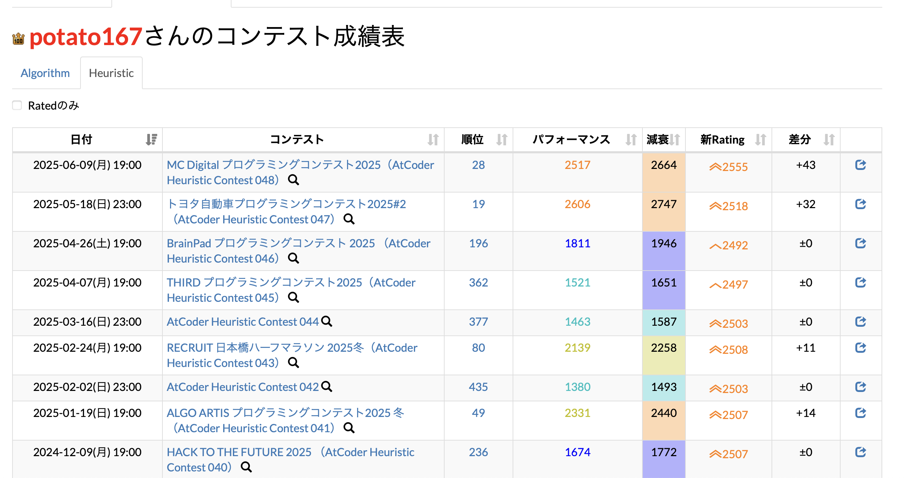
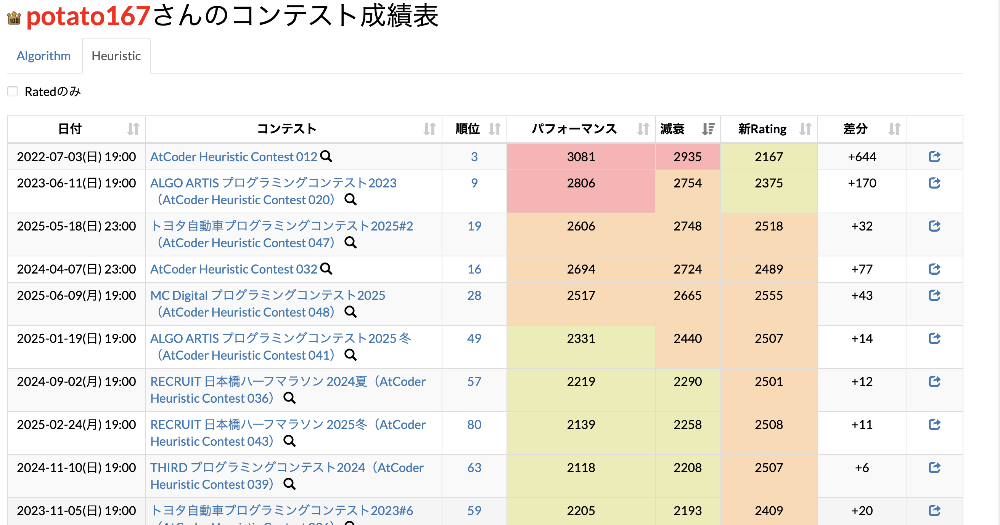

# AHC_decayed-performance

AtCoder のプロフィールの Heuristic 部門の成績ページに減衰パフォーマンスを表示します。

減衰パフォーマンスとは、[このドキュメント](https://img.atcoder.jp/file/AHC_rating_v2.pdf)([English](https://img.atcoder.jp/file/AHC_rating_v2.pdf))で紹介されている、日時に応じて減少するパフォーマンスで、具体的には、あるコンテストのパフォーマンスを $p$ とし、そのコンテストの終了日から最新の rated コンテストの終了日までの経過日を $d$ としたときに、以下の式で表される $P$ です。

$$P = p + 150 - 100\times\frac{d}{365}$$

このスクリプトでは $d$ をそのコンテストの終了日から**現在**までの経過日として、計算された減衰パフォーマンスを小数点四捨五入したものを以下のように表示します。

他の列と同様に、以下の画像のようにソートできます。(画像は、[AtCoderPerformanceColorizer](https://greasyfork.org/ja/scripts/371693-atcoderperformancecolorizer) と組み合わせたものです)

注意 : コードの大半を ChatGPT にお願いして作成しました。
